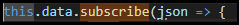

# セッション10
## データの読み込み
### 事前作業
- データファイルを`src/app/assets`の下などに配置しておく

### データ読み込み用のServiceクラス作成
- `src/app/shared`ディレクトリを作成
- `ng g service data`で`Sevice`クラスを作成
- `HttpClientModule`の`get()`メソッドでデータファイルを指定

### data-serviceの利用
- データを利用する`component`の`constructor`で`DataService`を定義

- `Subscribe`してデータを取り出す

----

## セッションのまとめ
- 次セッションでデータの操作と画面の表示を実施していきましょう

## Tips
- [HttpClientModule](https://angular.jp/guide/http)
- [Observables](https://angular.jp/guide/observables)