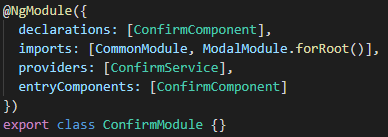
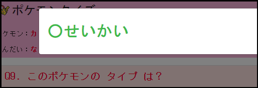
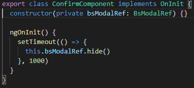

# セッション13
## Clickイベントとダイアログ表示
### Clickイベントの追加
- `html`側で`(click)`を設定し、クリック時に動くメソッドを指定

```
<button type="button" class="btn btn-info mb-1 col-lg-3 answer" (click)="register(answer1)">
    {{ answer1 }}
</button>
```

- `component`側で、`register()`メソッドを定義
- サンプルの様に`(click)="register(answer1)"`とすることで、`answer1`を引数として利用
- `register`メソッドの中で実際の答えと比較し、正解/不正解を判別


### ダイアログ表示
- `src/app/shared`配下に`modal`ディレクトリを作成し、`ng g component`及び`ng g module`を実施
	- ※`routing`は不要
- 同じ階層で`ng g service`も実施
- `module.ts`は以下のように記載（`confirm`という名称でダイアログを作成した場合）



- `service.ts`では`BsModalService`を`constructor`で定義し、`show()`を使ってダイアログ表示
- 正解/不正解を表示したい為、呼び出しメソッドの引数に`boolean`を用意しておくと良い


- `service.ts`の準備が出来たら、セッション12で作成した`register()`メソッドの中で呼び出す
- 以下のように表示されれば完了



----

## セッションのまとめ
次セッション以降で、componentの再利用について学んでいきます


## Tips
- [BsModalRefの使い方](https://stackblitz.com/edit/angular-modal-bootstap)
- `component`の`ngOnInit`などで`setTimeout`を利用し、`BsModalRef`の`hide()`を呼び出すと一定時間後にダイアログを閉じることが可能
- [ngx-bootstrap](https://www.npmjs.com/package/ngx-bootstrap)はAngular16で利用する場合は、version11で利用する


